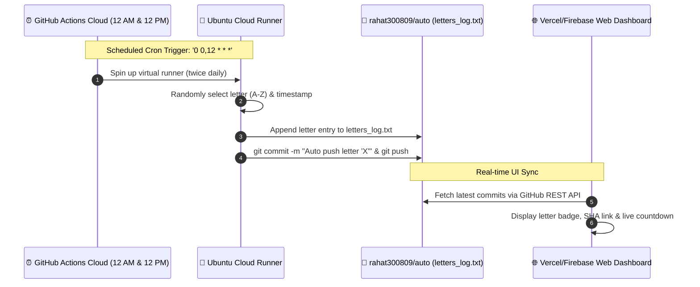

<div align="center">

# ⚡ AutoPush: 24/7 Automated GitHub Commit Engine & Live Dashboard

[](https://github.com/rahat300809/auto/actions)
[](https://vercel.com/new/clone?repository-url=https://github.com/rahat300809/auto)
[](https://firebase.google.com/)
[](https://opensource.org/licenses/MIT)

**A 100% automated, zero-maintenance cloud system and cyber-refined web dashboard that pushes a random letter to your GitHub repository twice daily (at 12:00 AM and 12:00 PM) without ever touching a keyboard.**

[Explore Web Dashboard](#-web-dashboard-overview) • [Key Benefits](#-key-benefits) • [Step-by-Step Tutorial](#-step-by-step-tutorial) • [Deploy on Vercel](#-how-to-host-on-vercel)

</div>

---

## 🌟 Why AutoPush? (Key Benefits)

| Benefit | How It Helps You |
| :--- | :--- |
| 🤖 **100% Hands-Free & Zero Manual Input** | Once activated, GitHub's cloud runners wake up automatically twice a day, pick a random letter, and push it. Your PC can be off, your browser closed — it never stops. |
| 🕒 **Twice-Daily Fixed Timing (12 AM & 12 PM)** | Perfectly timed scheduled commits at `00:00` and `12:00` UTC to maintain a consistent rhythm and pulse. |
| 🟢 **Activity & Streak Maintenance** | Keeps your repository dynamic and demonstrates active continuous integration and cron workflow execution. |
| 💰 **100% Free & Serverless** | Uses native **GitHub Actions** and **Vercel / Firebase Hosting** free tiers. No paid VPS, cloud functions, or server bills required. |
| 🖥️ **Cyber-Refined Live Dashboard** | Comes with a dark-mode web application featuring an animated countdown clock, 12-hour cycle progress bar, live commit stream, and instant test triggers. |
| 🔒 **Client-Side Privacy** | If you use the dashboard to test commits, your GitHub Personal Access Token stays strictly inside your browser's `localStorage` and is never sent to third-party servers. |

---

## 🏗️ How It Works (Architecture)



---

## 📖 Step-by-Step Tutorial

### 1. Enable GitHub Actions Write Permissions (One-Time Setup)
To allow GitHub's automated bot to commit and push to this repository:
1. Go to your repository settings: **[Settings &rarr; Actions &rarr; General](https://github.com/rahat300809/auto/settings/actions)**.
2. Scroll down to the **Workflow permissions** section.
3. Select **"Read and write permissions"**.
4. Click **Save**.

> [!TIP]
> That's it! GitHub Actions now has full authorization to commit autonomously.

---

### 2. Test the Cloud Automation Immediately
You don't need to wait for 12:00 to verify that everything works:
1. Navigate to the **[Actions Tab](https://github.com/rahat300809/auto/actions)** of this repository.
2. In the left sidebar, click **"Auto Push Daily Letter"**.
3. Click the **Run workflow** dropdown on the right &rarr; click the green **Run workflow** button.
4. Refresh after 15 seconds: you will see a brand new commit with a random letter in [`letters_log.txt`](letters_log.txt)!

---

## 🚀 How to Host the Web Dashboard

### Option A: Deploy to Vercel in 30 Seconds (Recommended)
1. Go to **[vercel.com/new](https://vercel.com/new)**.
2. Under **"Import Git Repository"**, select **`rahat300809/auto`**.
3. Keep default settings and click **Deploy**.
4. Vercel will instantly publish your dashboard at `https://auto-xxxx.vercel.app` with automatic continuous deployments on every commit!

*Or deploy from terminal:*
```bash
npx vercel login
npx vercel --prod
```

---

### Option B: Deploy to Firebase Hosting
1. Install Firebase CLI (if needed): `npm install -g firebase-tools`
2. Authenticate:
   ```bash
   firebase login
   ```
3. Deploy:
   ```bash
   firebase deploy --only hosting
   ```

---

## 💻 Running the Web Dashboard Locally

If you want to run the live dashboard on your local machine:

```bash
# Clone the repository
git clone https://github.com/rahat300809/auto.git
cd auto

# Start the preview server
node serve.js
```
Open **`http://localhost:5173`** in your browser.

---

## ⚙️ Customizing the Schedule & Letter Mode

You can adjust the schedule or behavior by editing [`.github/workflows/auto-push.yml`](.github/workflows/auto-push.yml):

### Change the Push Times
In line 6 of `.github/workflows/auto-push.yml`:
```yaml
on:
  schedule:
    # Current: 12:00 AM and 12:00 PM UTC
    - cron: '0 0,12 * * *'
```
* **Every 6 hours**: `- cron: '0 */6 * * *'`
* **Once a day at midnight**: `- cron: '0 0 * * *'`
* **Every hour**: `- cron: '0 * * * *'`

### Change the Content Pool
In line 25 of `.github/workflows/auto-push.yml`:
```bash
# Change to lowercase letters, numbers, or custom characters
LETTERS="ABCDEFGHIJKLMNOPQRSTUVWXYZ0123456789"
```

---

## 📂 Repository Structure

```
├── .github/
│   └── workflows/
│       └── auto-push.yml    # 24/7 Scheduled Cloud Cron Workflow (12 AM & 12 PM)
├── public/
│   ├── index.html           # High-tech Cyber Dark UI
│   ├── styles.css           # Glassmorphism, animations, glowing design tokens
│   └── app.js               # Countdown engine, GitHub REST client, commit parser
├── firebase.json            # Firebase Hosting configuration
├── .firebaserc              # Firebase project settings
├── vercel.json              # Vercel zero-config routing
├── package.json             # NPM scripts
├── serve.js                 # Local preview server
├── letters_log.txt          # Live stream log where random letters are appended
└── README.md                # Comprehensive documentation
```

---

## 🔒 Security & Privacy

- **Token Safety**: All Personal Access Tokens entered into the dashboard are stored only in your local browser storage (`localStorage`) and communicated directly with `api.github.com` over SSL.
- **Workflow Isolation**: The GitHub Action uses GitHub's internal, ephemeral `GITHUB_TOKEN` with tightly scoped write permissions.

---

<div align="center">
  <sub>Built with ❤️ by <a href="https://github.com/rahat300809">rahat300809</a> • Powered by GitHub Actions, Vercel & Firebase</sub>
</div>
