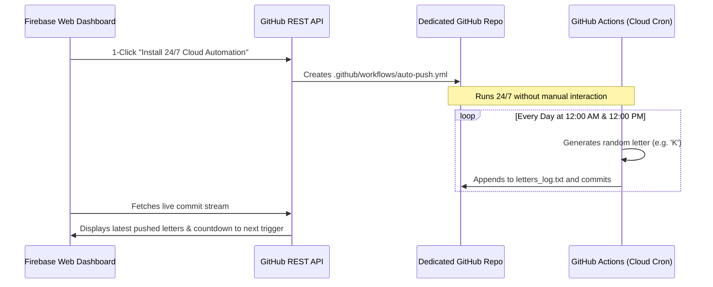

# 🚀 AutoPush | Automated Daily GitHub Commit Engine

An automated cloud system and cyber-refined web dashboard hosted on **Firebase Hosting** that automatically pushes a random letter to your dedicated GitHub repository twice daily (**at 12:00 AM and 12:00 PM**) with **zero manual intervention**.

---

## 🌟 Features

- **24/7 Unattended Cloud Automation**: Commits and pushes automatically twice every single day (12:00 AM & 12:00 PM) on GitHub's cloud runners even when your computer is shut down.
- **Auto Countdown Clock**: Real-time animated digital countdown ticking down to the exact next 12:00 AM or 12:00 PM trigger with progress tracking.
- **Timezone Flexible**: Supports toggling between your **Local Browser Time** and **UTC Time**.
- **1-Click Cloud Automation Setup**: Enter your repo name and GitHub token on the dashboard, click *"Install 24/7 Cloud Automation"*, and the website writes `.github/workflows/auto-push.yml` directly to your repository via the GitHub REST API!
- **Instant Test Push**: Test the connection anytime with an instant commit button.
- **Live Commit Feed**: Displays recent commits from your repository, highlighting the pushed letters, commit SHAs, authors, and timestamps.
- **Customizable Modes**: Choose between Uppercase letters (A-Z), Lowercase (a-z), Alphanumeric (A-Z, 0-9), Random words, or Emojis + Letters.
- **100% Free & Serverless**: Runs completely on Firebase Hosting + GitHub Actions with zero server hosting costs.

---

## ⚡ Quick Start & Setup (3 Steps)

### Step 1: Create a GitHub Personal Access Token
1. Go to [GitHub Settings &rarr; Personal Access Tokens (Classic)](https://github.com/settings/tokens/new?description=AutoPush%20Firebase%20Engine&scopes=repo,workflow).
2. Give it a name (e.g. `AutoPush Engine`).
3. Check the **`repo`** scope and the **`workflow`** scope.
4. Click **Generate token** and copy the token (starts with `ghp_...`).

---

### Step 2: Open or Run the Web Dashboard
You can run the web dashboard locally:

```bash
# In the project directory:
npx serve public
```
Open `http://localhost:3000` (or the port shown in your terminal).

1. Fill in your **GitHub Username**, **Repository Name**, and paste your **GitHub Token**.
2. Click **"🚀 Install 24/7 Cloud Automation"**.
   - The web app connects to your repo and creates `.github/workflows/auto-push.yml`.
   - GitHub Actions will now automatically wake up twice daily at **12:00 AM and 12:00 PM** and push a random letter!
3. Click **"⚡ Instant Test Push Now"** to verify that a letter is committed immediately to your repository!

---

### Step 3: Deploy to Firebase Hosting

To host this website live on Firebase:

```bash
# 1. Login to your Firebase account (if not already logged in)
firebase login

# 2. Link your Firebase project
firebase use --add

# 3. Deploy the website live to the internet
firebase deploy --only hosting
```

Your live site URL will be displayed in the terminal (e.g., `https://your-project.web.app`).

---

## 📁 Repository Structure

```
├── public/
│   ├── index.html       # Modern cyber-dark dashboard UI
│   ├── styles.css       # Design tokens, glowing animations, glassmorphism
│   └── app.js           # Countdown engine, GitHub REST API client, live feed
├── workflows/
│   └── auto-push.yml    # GitHub Actions cron workflow (00:00 & 12:00 UTC)
├── firebase.json        # Firebase Hosting deployment config
├── .firebaserc          # Firebase project definition
└── README.md            # Complete documentation
```

---

## 🕒 How the Automation Works Behind the Scenes



---

## 🔒 Security Note
Your GitHub Personal Access Token is stored exclusively in your browser's local storage (`localStorage`). It is only transmitted directly to official GitHub API endpoints (`api.github.com`) over secure HTTPS. No third-party servers ever touch your credentials.
